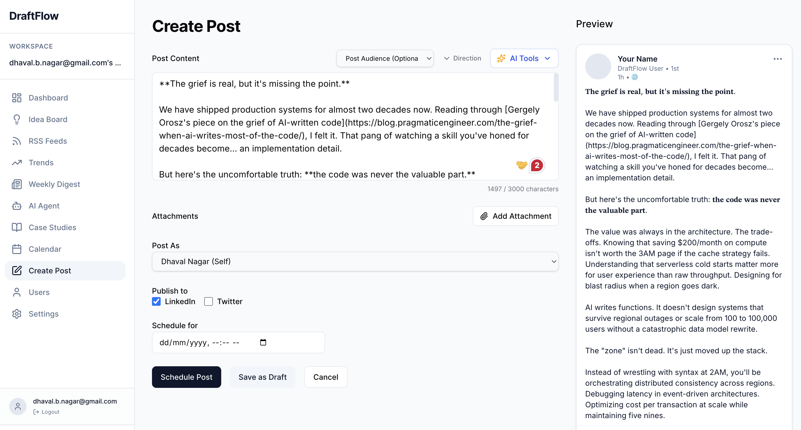
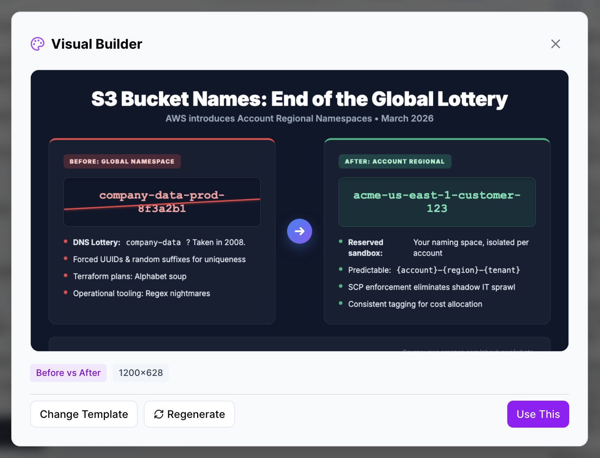
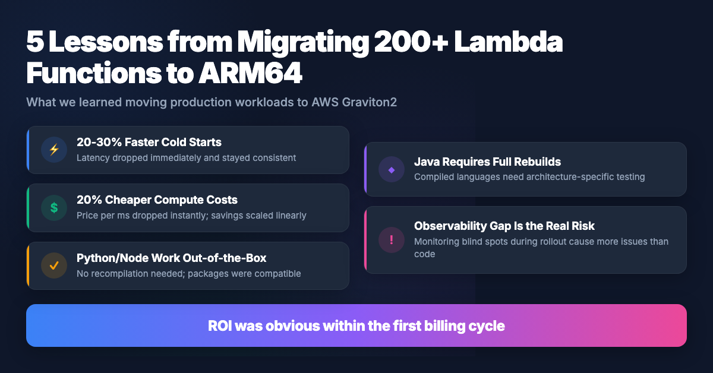

# DraftFlow

A self-hosted, AI-powered social media scheduling platform. Create, refine, and publish posts to LinkedIn and Twitter with AI assistance, trend tracking, and a weekly digest feature.

## Features

- **Multi-Platform Publishing** — Schedule and publish posts to LinkedIn and Twitter/X
- **Idea Board** — Capture ideas and convert them into polished posts with AI
- **AI Writing Assistant** — Generate, improve, and iterate on content using your choice of models through OpenRouter (Anthropic / Gemini / DeepSeek / Kimi / Qwen, etc)
- **Trending Topics** — Discover what's trending in your industry with web search (Tavily)
- **Carousel Builder** — Create multi-slide PDF carousels for LinkedIn with AI-generated content and templates
- **Inspiration Feed** — Curated swipe file aggregating bookmarked articles, top posts, and wiki knowledge
- **Visual Builder** — Turn any post into a styled infographic image with AI-generated templates
- **RSS Feeds** — Subscribe to RSS feeds, browse articles, and turn them into posts or ideas
- **Weekly Digest** — Auto-curate the biggest stories of the week into a short-form post
- **Calendar View** — Visualize your content schedule at a glance
- **Recurring Posts** — Set up ideas that auto-generate on a daily, weekly, or monthly schedule
- **Multi-Tenant** — Support for multiple workspaces and team collaboration
- **Markdown Support** — Write in `**bold**` and `*italic*`, auto-converted to Unicode for LinkedIn
- **LLM Wiki** — Persistent, compounding knowledge base inspired by [Karpathy's LLM Wiki](https://gist.github.com/karpathy/442a6bf555914893e9891c11519de94f)
- **AI Agent Pipeline** — Mastra supervisor agent orchestrates researcher, writer, and editor agents
- **MCP Integration** — Extend AI capabilities with Model Context Protocol servers



### LLM Wiki — Persistent Knowledge Base

Inspired by [Andrej Karpathy's LLM Wiki concept](https://gist.github.com/karpathy/442a6bf555914893e9891c11519de94f), DraftFlow maintains a **compounding knowledge base** per workspace that grows smarter with every ingested source.

**The problem with typical AI content tools:** They start from scratch every time — re-discovering context by searching databases and the web, producing shallow, inconsistent output.

**The LLM Wiki approach:** Instead of ephemeral retrieval (RAG), DraftFlow maintains structured markdown wiki pages that the AI reads, writes, and updates over time. Feed it a URL, article, or RSS item and the AI extracts knowledge into focused wiki pages, cross-references with existing pages, and maintains an auto-generated index.

```
wiki/{tenantId}/
  index.md        ← Auto-maintained page catalog
  log.md          ← Chronological activity log
  serverless.md   ← Knowledge: serverless architecture patterns
  ai-agents.md    ← Knowledge: AI agent frameworks
  ...
```

**Three operations:**
- **Ingest** — Feed a URL or text. AI extracts knowledge into 1-5 wiki pages.
- **Query** — Keyword search across all pages. The AI agent checks the wiki before web search.
- **Browse/Edit** — Full CRUD UI to read, edit, and manage wiki pages.

**How it helps content generation:**
- The researcher agent queries the wiki first, using accumulated domain knowledge instead of starting from scratch
- "LLM Wiki" is a content source option alongside trends, ideas, and case studies
- RSS articles can be ingested into the wiki, turning news streams into reusable knowledge
- Existing content (published posts, trends, ideas) can be bulk-hydrated via `npx ts-node scripts/hydrate-wiki.ts`

As Karpathy puts it: *"The tedious part of maintaining a knowledge base is not the reading or the thinking — it's the bookkeeping."* The LLM handles the bookkeeping.

### Visual Builder

Generate eye-catching infographic images from your post content. Choose from 6 templates — Infographic, Before vs After, Checklist, Quote Card, Stats, and Step-by-Step — and the AI converts your text into a styled visual, ready to attach to your post.





### Carousel Builder

Create LinkedIn carousel posts (multi-slide PDFs) from a standalone builder page. Enter a topic or paste content, pick a template, and let AI generate a slide deck rendered as a 1080x1080 PDF.

- **5 templates**: Step Guide, Listicle, Tips, Checklist, Stats Deck
- **Two generation modes**: "Generate" (content only) and "Research & Generate" (Tavily web search + content)
- **Branding**: Add your name, handle, tagline, and CTA — persisted in settings
- **Save & reuse**: Save generated carousels for later use
- **Post integration**: "Create Post" attaches the PDF and navigates to the post editor
- **Slide count**: Choose 3, 5, 7, or 10 slides per carousel

### Inspiration Feed

A curated swipe file that aggregates your best content sources into one browsable page:

- **Bookmarked RSS articles** — Articles you've bookmarked from the Feeds page
- **Favorited posts** — Your published posts marked with a star from the dashboard
- **Wiki pages** — Knowledge pages from your LLM Wiki

Filter by source tab, search across all content, and quickly turn any inspiration into a new post.

## Architecture

```
frontend/          Next.js (React 19) dashboard
backend/           Express + TypeScript API server
  ├── src/
  │   ├── routes/       API endpoints
  │   ├── services/     Business logic (AI, Wiki, LinkedIn, Twitter, Scheduler)
  │   ├── middleware/   Auth middleware
  │   └── db.ts         Sequelize models (SQLite)
  ├── wiki/             LLM Wiki markdown files (per tenant)
  ├── uploads/          File uploads (images, visuals)
  ├── scripts/          Utility scripts (wiki hydration, etc.)
  └── migrations/       SQL migration files
```

## Quick Start (Docker)

```bash
git clone https://github.com/AppGambitStudio/DraftFlow.git
cd draftflow

# Copy and configure environment
cp backend/.env.example backend/.env
# Edit backend/.env — set JWT_SECRET (required) and other keys

# Start everything
docker-compose up --build
```

- **Frontend**: http://localhost:5003
- **Backend API**: http://localhost:5002

## Local Development

### Prerequisites

- Node.js v18+
- npm

### Backend

```bash
cd backend
npm install
cp .env.example .env
# Edit .env — JWT_SECRET is required
npm run dev
```

### Frontend

```bash
cd frontend
npm install
npm run dev
```

Frontend runs on port 5003, backend on port 5002.

### First Run

1. Open http://localhost:5003 and create an account (Sign Up)
2. Go to **Settings** and configure:
   - **OpenRouter API Key** — Required for AI features ([openrouter.ai](https://openrouter.ai))
   - **LinkedIn OAuth** — Client ID & Secret for LinkedIn publishing
   - **Twitter OAuth** — Client ID & Secret for Twitter publishing
   - **Tavily API Key** — Optional, for web search / trending topics ([tavily.com](https://tavily.com))

### OAuth Callback URLs

When setting up OAuth apps on LinkedIn/Twitter developer portals:

- **LinkedIn**: `http://localhost:5002/api/auth/linkedin/callback`
- **Twitter**: `http://localhost:5002/api/auth/twitter/callback`

## Database

DraftFlow uses **SQLite** via Sequelize ORM.

- New tables are auto-created on startup via `sequelize.sync()`
- Schema changes to existing tables require manual migrations

### Running Migrations

Migrations are SQL files in `backend/migrations/`. Apply them with:

```bash
cd backend
sqlite3 dev.db < migrations/YYYYMMDD_HHMMSS_description.sql
```

## Environment Variables

See [`backend/.env.example`](backend/.env.example) for all available variables.

| Variable | Required | Description |
|----------|----------|-------------|
| `JWT_SECRET` | Yes | Secret key for JWT token signing |
| `DATABASE_URL` | No | SQLite path (default: `file:./dev.db`) |
| `PORT` | No | Backend port (default: `5002`) |
| `FRONTEND_URL` | No | Frontend URL for invite links (default: `http://localhost:3000`) |
| `LINKEDIN_CLIENT_ID` | No | LinkedIn OAuth (can also set in Settings UI) |
| `LINKEDIN_CLIENT_SECRET` | No | LinkedIn OAuth secret |
| `TWITTER_CLIENT_ID` | No | Twitter OAuth (can also set in Settings UI) |
| `TWITTER_CLIENT_SECRET` | No | Twitter OAuth secret |

## Tech Stack

- **Frontend**: Next.js 16, React 19, Tailwind CSS, Recharts
- **Backend**: Express 5, TypeScript, Sequelize, SQLite
- **AI**: OpenRouter API (Claude, GPT, etc.), Tavily web search
- **Agent Framework**: Mastra.io with MCP support

## License

[ISC](LICENSE)
